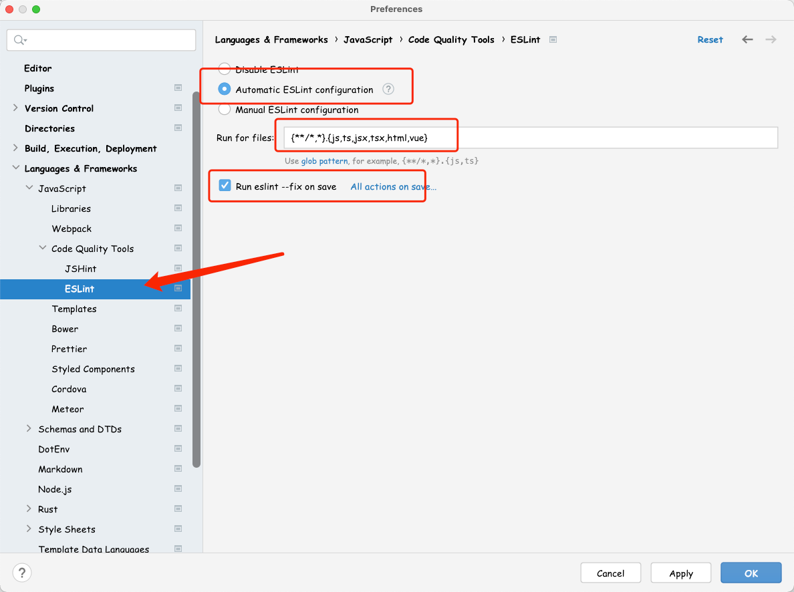
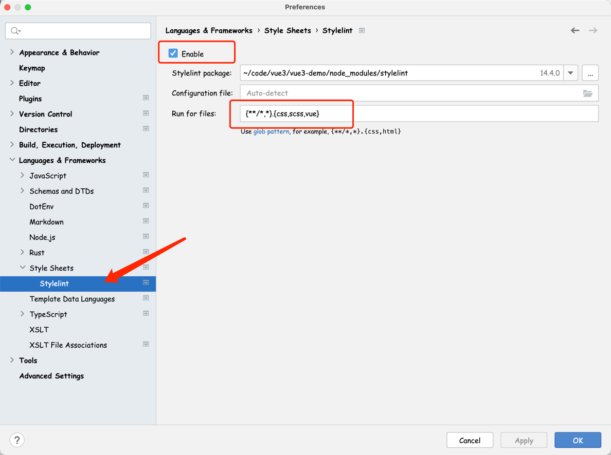
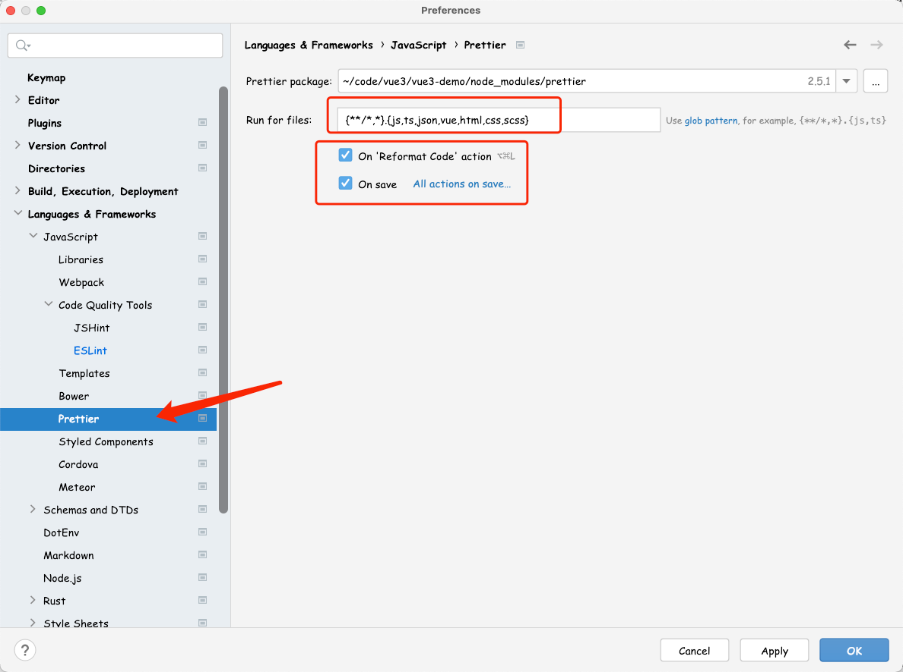

## Webstorm 设置 Eslint/Prettier/Stylelint

项目中采用 Eslint 规范 JavaScript/TypeScript，用 StyleLint 规范 CSS/SCSS，用 Prettier 格式化代码，为了让编辑器更好的工作，需要分别对相关插件进行配置。

### Eslint 配置

在设置里面找到 `Preferences > Languages & Frameworks > JavaScript > Code Quality Tools > ESLint`，进行如下设置：

1. 设置为自动 EsLint 配置
2. Run for files 配置为：`{**/*,*}.{js,ts,jsx,tsx,html,vue}`
3. 勾选 Run eslint --fix on save

### Stylelint 配置

在设置里面找到 `Preferences > Languages & Frameworks > Style Sheets > Stylelint`，进行如下设置：

1. 勾选 Enable
2. Run for files 配置为: `{**/*,*}.{css,scss,vue}`

### Prettier 配置

在设置里面找到 `Preferences > Languages & Frameworks > JavaScript > Prettier`，进行如下设置：

1. Run for files 配置为：`{**/*,*}.{js,ts,json,vue,html,css,scss}`
2. 勾选 On 'Reformat Code' action
3. 勾选 On save

